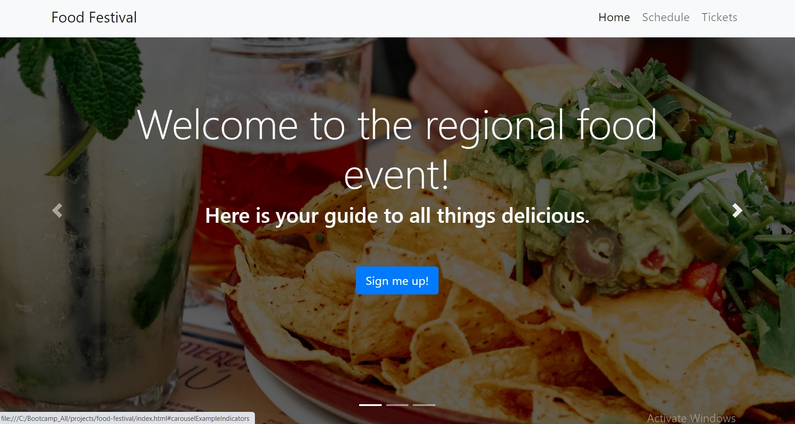
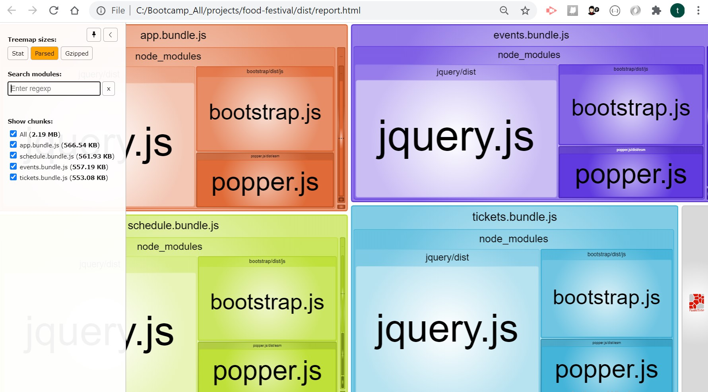

# food-festival

Mobile web application showing food venue details such as event info, schedule, and ticket purchasing options, utilizing PWA techniques for improving page load performance through webpack bundling, offline usability through an IndexedDB object store and caching through a service worker.

## GitHub URL

https://github.com/ktrnthsnr/food-festival

## GitHub hosted website

https://ktrnthsnr.github.io/food-festival

## Table of Contents

* [Description](#description)
* [Technology](#technology)
* [Installations](#installations)
* [Usage](#usage)
* [Performance](#performance)
* [Contribution](#contribution)

## Description

This website build project contains Progressive Web Application (PWA) elements for adding offline functionality, quick performance, smooth scrolling, and no lag targeted specifically for a mobile user. The Food Festival website is heavy on vivid imagery in a site menu and carousel showcasing a home page, schedule, and a page for ordering tickets to the festival, so image and javascript bundling and optimization on first load were essential towards improving performance. Additionally an IndexedDB store, and service worker caching were added to allow for internet connectivity interrupts, very common for mobile app users, to allow for seamless web app scrolling, and ticket purchasing - with or without an internet connection.

## Technology

This project required the following technology to create, audit and optimize:

- Platform, framework, and scripting languages: 
Node.js, npm, GitHub, JavaScript, ES6, HTML, CSS, webpack-dev-server

- Performance monitoring tool, and optimization, caching, and PWA plugins: 
Google Chrome DevTools & Lighthouse, webpack bundler, webpack-bundle-analyzer, file-loader, image-webpack-loader, SW-precache-webpack, webpack-PWA-manifest plugins

## Installations

For local installations
- Prereq for your desktop: Install VSCode and Node.js on your desktop.
- Then clone this GitHub repo to your local drive.
- To install all dependency components listed within the package.json file for npm, run in the VS Code bash terminal:
- $ `npm i`
-
- Below are are each installation components utilized for this project:

(Note, to run this application and website, you do not need to install these. These are listed to itemize the npm modules used to create the bundles and optimizations, and therefore the config and scripts have already been updated to support these optimizations.)

- Created a new package.json, started with initializing npm
- $ `npm init --y` or $ `npm install`
- Installed webpack and webpack CLI
- $ `npm i -D webpack webpack-cli`
- Checked webpack is installed, checking for the version
- $ `webpack -v`
- Received this error, `webpack: command not found` resolved by running this
- $ `npm run webpack -v`
- Installed the jquery package
- $ `npm i jquery`
- Installed bootstrap
- $ `npm i bootstrap`
- Installed popper.js
- $ `npm i popper.js`
- Installed the webpack-bundle-analyzer
- $ `npm install -D webpack-bundle-analyzer`
- Installed file-loader to optimize image files
- $ `npm install -D file-loader`
- Installed webpack loader
- $ `npm install image-webpack-loader`
- Installed dev server to view the mobile app locally
- $ `npm install webpack-dev-server -D`

## Usage

- This application's website is hosted on GitHub https://ktrnthsnr.github.io/food-festival
- 

- If cloning this repo to your desktop, and after completing the npm installation per above `npm i`, you may view the website by right clicking `index.html` and viewing on your browser, 
for example, `C:/projects/food-festival/index.html`

- To view the application on the development server, run on your bash terminal and view the cached objects within Chrome DevTools on the browser at `http://localhost:8080`
- $ `npm run start:dev`

- To execute a webpack and view the report.html of bundled components, run in the bash terminal the following: (Note, this will recreate the bundled files on dist folder as well.)
- $ `npm run build`
- This will start an interactive tree map and will render a report.html in the browser locally under c:/food-festival/dist/report.html, showing each bundle size being loaded.  Here is the webpack report after modularization:
- 

- As a PWA, the user may save the application on their mobile device.

## Performance

- For this project, I've completed performance testing before and after applying fixes.
- Firstly, performance testing showed: logos and app images makes rendering and adding orders slow. 
    * Audited website performance load times with Google Chrome > devtools > Lighthouse tool for mobile
- Applied these fixes: optimization techniques used to quicken page load time, including
    * Minified JS files through https://javascript-minifier.com/ 
    * Compressed images, from PNG (lossless) to JPG (lossy) with Optimizilla https://imagecompressor.com/
    * Added image and JavaScript lazy loading
    * Updated code from synchronous to asyncs
    * Removed extraneous JavaScript libraries

## Contribution

ktrnthsnr

### ©️2020 ktrnthsnr
